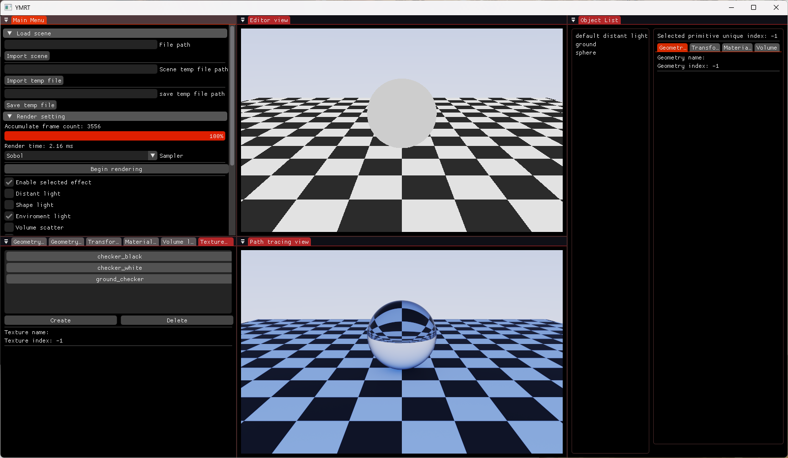
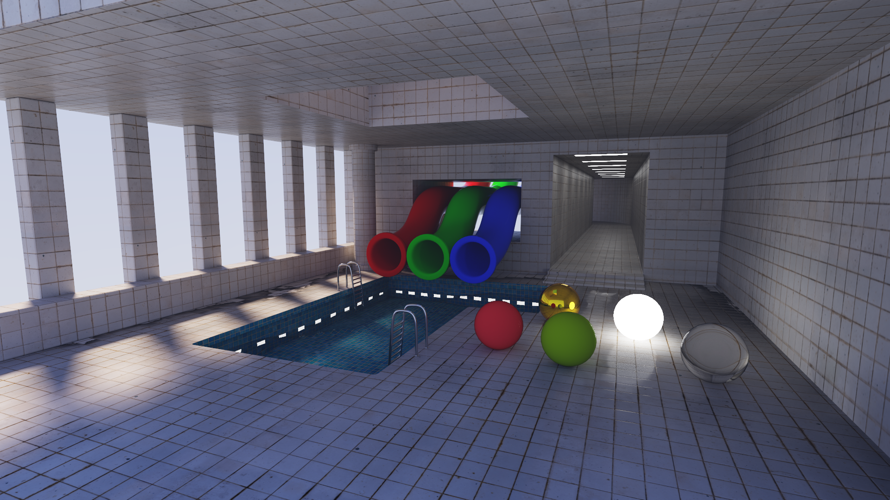
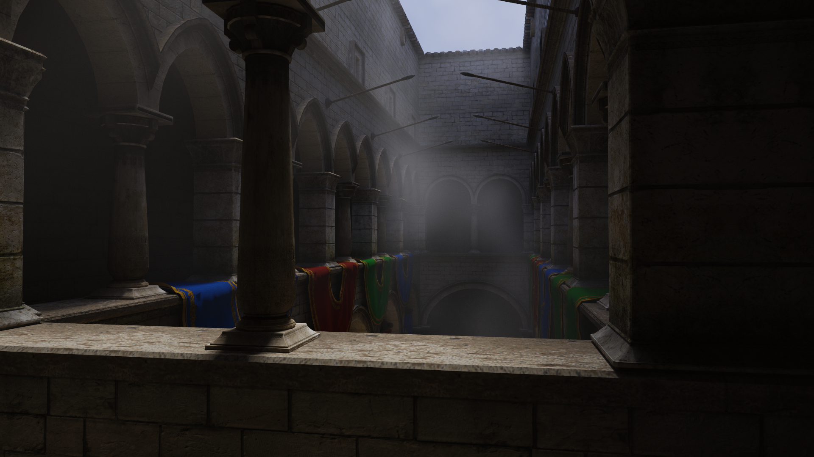

# YMRT

**English** | [中文](README.zh-CN.md)

A simple CUDA-based IPR path tracer.

## Build

### Requirements

Tested on Windows with the following configurations:

- RTX 3060 Laptop — CUDA 11.8.89, MSVC 19.29.30154 (VS2019)
- RTX 5080 — CUDA 13.2.51, MSVC 19.44.35225.0 (VS2022)

Additional requirements:

- A GPU with OpenGL 4.5 support
- CMake 3.20 or newer

All third-party libraries ([glad](https://github.com/Dav1dde/glad), [glfw](https://github.com/glfw/glfw), [assimp 5.1.0](https://github.com/assimp/assimp), [imgui](https://github.com/ocornut/imgui), [glm](https://github.com/g-truc/glm), [stb](https://github.com/nothings/stb)) are vendored under `external/`, so no manual dependency setup is needed.

### Steps

#### Command line

1. Open a terminal in the project directory.

2. Create a build directory:

```bash
mkdir build
```

3. Configure the project with CMake (the Visual Studio generator is used):

```bash
cmake -S . -B build
```

4. Build from the command line:

```bash
MSBuild build/YMRT.sln -p:Configuration=Release -p:Platform=x64 -m
```

The executable is produced at `build/Release/YMRT.exe`. The build copies `shaders/`, `model/` and `test_assests/` next to the executable.

#### Visual Studio GUI

1. Open the CMake GUI; set the source directory to the project directory and the build directory to its `build` subfolder.

2. Click Configure, choose your Visual Studio version and the `x64` platform, then click Generate once configuration finishes.

3. Open the generated `build/YMRT.sln` in Visual Studio.

4. Build the solution (Release configuration).

5. Set `YMRT` as the startup project, then run it.

> [!WARNING]
> Modifying `.h` or `.cuh` files may not trigger CUDA recompilation — rebuild manually.

## Features

- **Wavefront path tracing**
- **BSDFs common in PBR workflows**
- **Volumetric rendering**
- **Texture system** — image texture and nested texture
- **Low-discrepancy sampling**
- **Interactive editor** — object properties can be edited in real time
- Scenes can be temporarily saved using the internal format

**Not yet implemented:** environment lighting from HDR textures and multi-light sampling with LightBVH.

## Interface Layout



## Tests



Scene: `src/model/pool_test.ymtmp`



Scene: `src/model/Sponza_Test.ymtmp`

## Usage

See [usage.md](usage.md).

## References

All test scenes under `src/model`, except `CornellBox_Test.ymtmp` and `pool_test.ymtmp`, come from https://casual-effects.com/g3d/data10/index.html. Textures used in `pool_test.ymtmp` are from Quixel Bridge. Textures under `src/test_assests` are from [Poly Haven](https://polyhaven.com/). If any of these models inadvertently infringes your copyright, please contact me and they will be removed.
