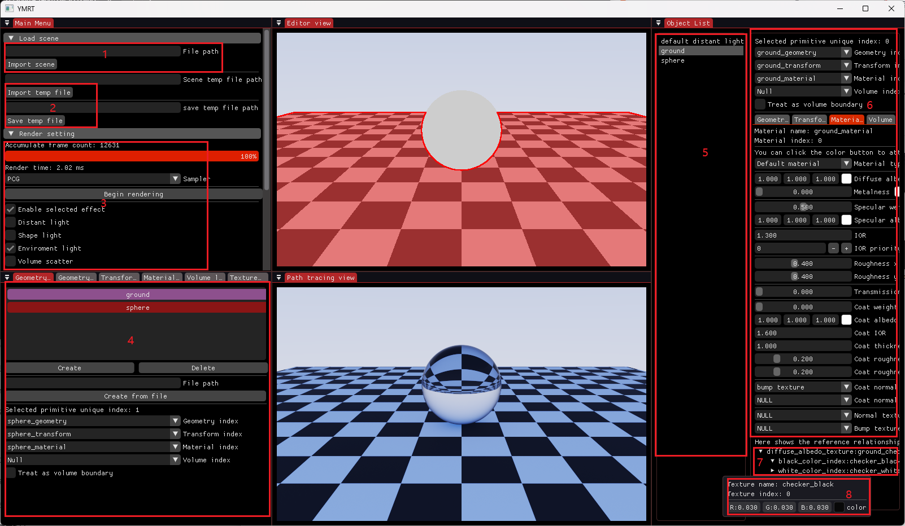
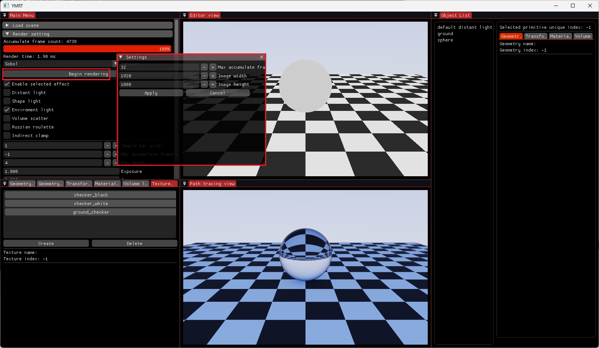
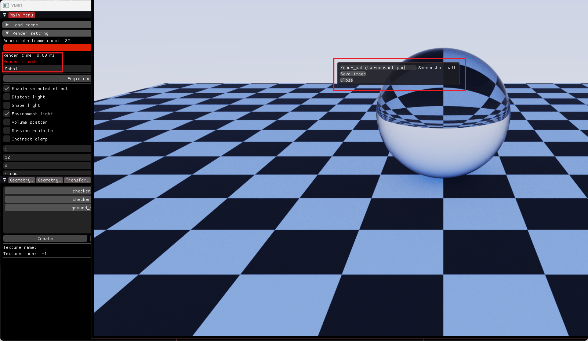

# YMRT 使用

[English](usage.md) | **中文**

## 基本布局

启动 `YMRT.exe` 打开编辑器窗口:

- **Editor view**——场景的 OpenGL 实时预览。WASD 控制摄像机位置，QE 控制高度;按住鼠标左键拖拽旋转视角，左键点击物体即可选中。
- **Path tracing view**——CUDA 渐进式渲染，持续累积直至收敛
- **编辑面板**——对应下图中的编号:

1. **载入场景**——载入 assimp 支持的各路场景格式，如 OBJ、FBX(输入文件的绝对路径就行)。
2. **临时文件**——存取临时场景文件(后缀名必须是 .ymtmp，如 `src/model/CornellBox_Test.ymtmp`)。
3. **渲染设置**——可以设置最大累积帧数、每像素采样、采样器、光线深度等属性。
4. **资源列表**——场景中的全部几何、材质、纹理等资源。在列表中选中的条目高亮为红色，Editor view 中选中的物体引用的条目高亮为紫色，二者重合时呈灰白色。点击 Delete 会移除红色高亮的条目。
5. **大纲视图**——场景对象清单(如图中的 default distant light)。
6. **属性面板**——选中图元的 Geometry / Transform / Material / Volume 绑定与参数(图中激活的是 Material 标签)。
7. **树形视图**——当前资源引用到的条目，可能是变换或纹理。左键点击条目即可展开(展开后前面的小箭头朝下)。
8. **资源属性编辑窗口**——右键点击树形视图中已展开的条目后弹出。

**设置光源**:选中一个物体，然后在材质编辑器中把它的 Material type 改成 Light material。

仓库在 `src/model/` 下自带示例场景(CornellBox、Sponza、pool test 等)，格式为 `.ymtmp` 场景文件。

## 渲染和截图

点击 Render setting 下拉列表里的 Begin rendering，会弹出一个小窗口，提示设置图像的最大累积帧数和分辨率。输入好参数后点击 Apply，渲染就会启动。

渲染期间，Path tracing view 将作为独立窗口显示，无法停靠，直到渲染完成。当累积帧数达到设定的最大值时，Render setting 处会提示 "Render finish"。此时右键点击 Path tracing view，会弹出截图窗口，输入路径就可以保存截图了(目前只能保存 png)。

需要特别注意的是，截图只能在 Path tracing view 处于独立窗口状态时进行;渲染完成后如果马上把它停靠回原位，就无法截图了。
